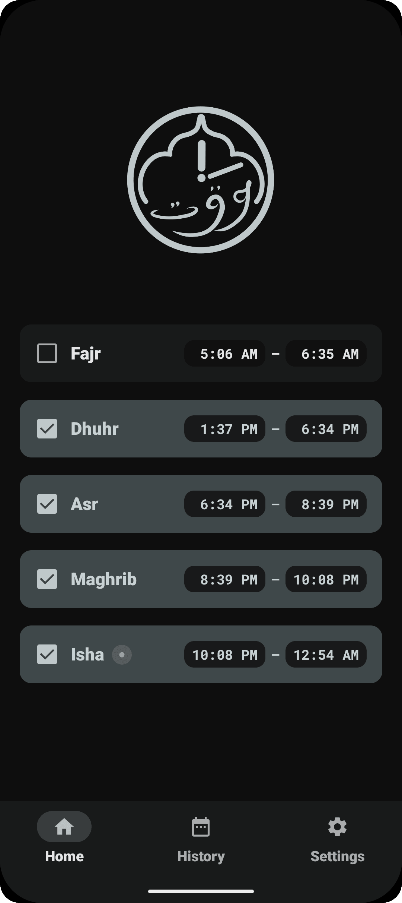
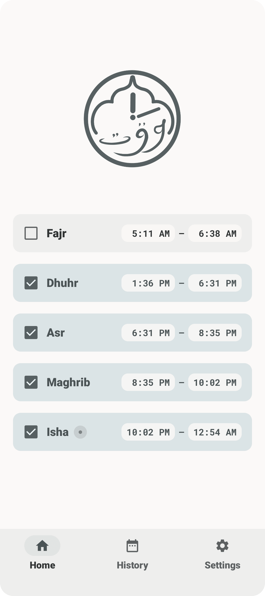
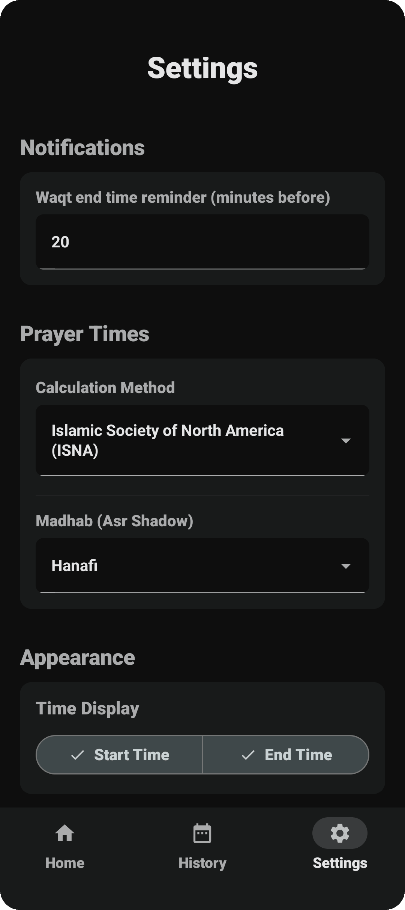
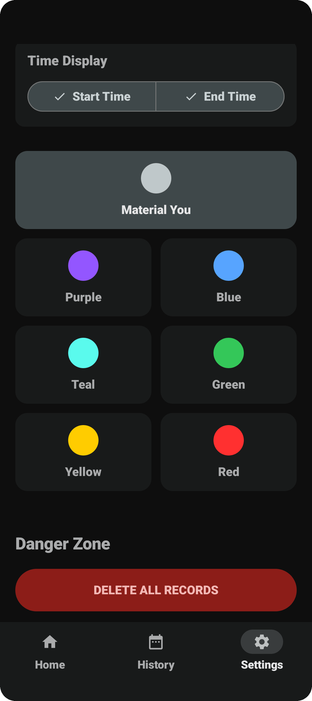
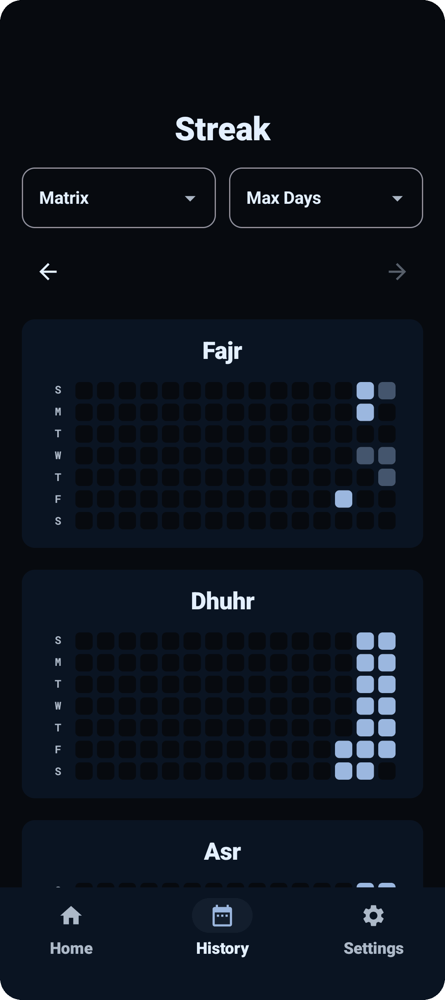
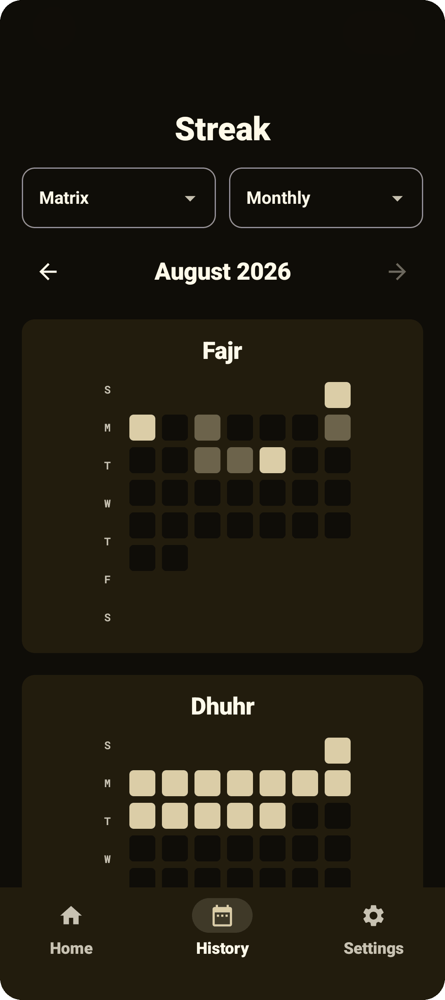
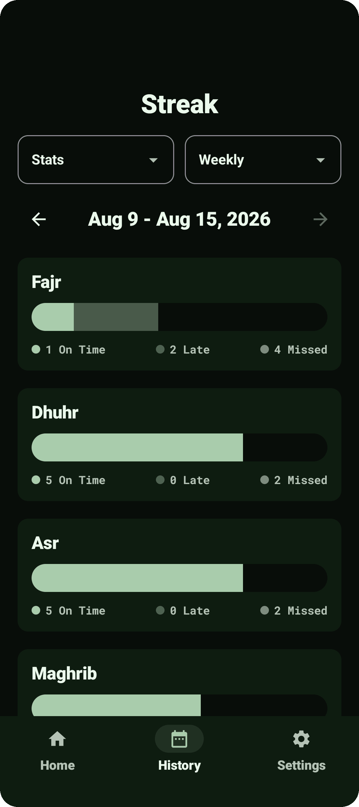
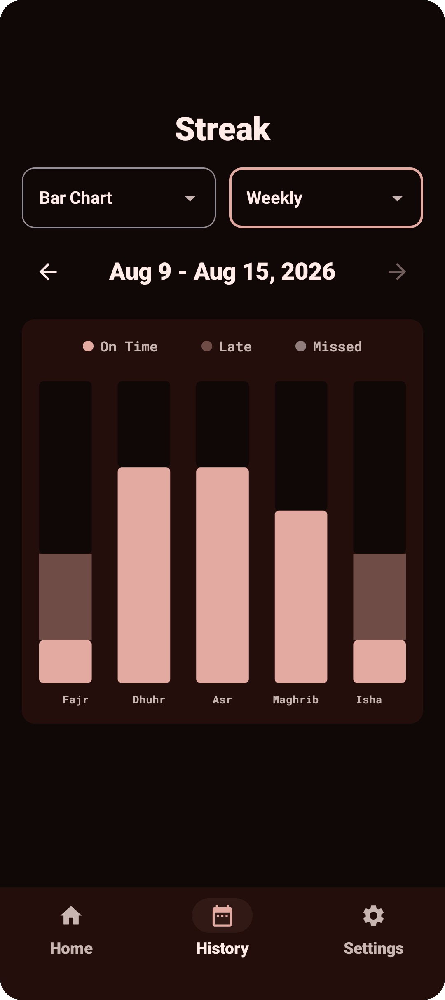

# Waqt

  

- Do you tend to wait to pray until the very last minute and sometimes even miss the prayer?
- Do you have days when you wonder whether you've already prayed a prayer or not?
- Do you wish you had a personal assistant to remind you to pray, not right after the Adhan, but when it is convenient for you? Or just before time runs out?
- Are you especially motivated by tasks that are gamified?

If you said yes to any of these questions, you might want to give Waqt a shot.

**Disclaimer:** Everyone should try to pray as close to Adhan as possible. However, for some of us, that is just hard to do for various reasons. _Waqt_ is designed to provide different people the different types of push they need to make daily prayers a consistent part of their lives. Whether it is a completion graph to act as a visual representation of their earned rewards or just a little nudge at the right time.

  
  
  
  

  
  
  
  

## Features Checklist

- [x] Track daily prayer completion with a GitHub contribution graph style streak grid
- [x] Material You dynamic theming and custom color selection
- [x] _Waqt_ and location-based prayer notifications
- [x] _Waqt_ expiration notifications
- [x] Customizable calculation methods
- [x] Graphs that take _Qada_ prayers into account
- [ ] A more advanced score system to incentivize praying in congregation, within _x_ minutes of Adhan, etc.
- [x] More ways to represent your history data (Bar charts, Heatmaps, Month view, Year view, etc)
- [x] Ability to look at older history data
- [ ] Ability to navigate back to & edit older dates in the home screen
- [x] Custom reminder & "custom reminder offset until prayer time expires" option in settings
- [ ] Haptics
- [ ] Backup/Restore data functionality
- [ ] Ability to keep track of prayer data for as long or delete until a specific date
- [x] Delete data button
- [ ] Export history as spreadsheet file
- [ ] Widgets

 

### Personal Story

The motivation behind this app comes from my own struggle with procrastination. In our busy lives, it's easy to not prioritize prayer. For me, I often find myself putting it off until suddenly I notice the next prayer is approaching—and then I either rush to pray at the last second or miss it entirely. While there are other apps that remind you at Adhan time, they don't help much if you can't pray right away. A second, well-timed reminder is rare in any other prayer-time apps. That's why I created _Waqt_. I am also a completionist, so the github-style graph and the in-app reward system give me a secondary incentive to keep getting up to pray even when my body doesn't want to.
